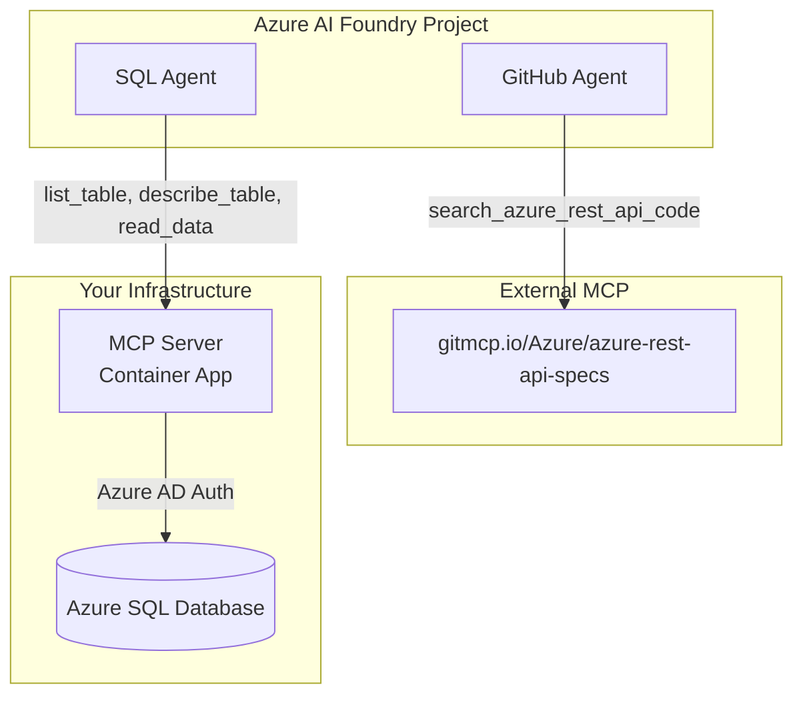

# Multi-Agent MCP Architecture with Azure AI Foundry

This repository showcases how **Azure AI Foundry Agent Service** can leverage both **internal (self-hosted)** and **external** Model Context Protocol (MCP) servers to create powerful, specialized AI agents.

## 🎯 What This Demonstrates

### **Two MCP Integration Patterns**

1. **🐙 External MCP** - Connect to third-party MCP services (GitHub, APIs, etc.)
2. **🗄️ Internal MCP** - Deploy your own MCP server with custom tools

### **Real-World Example: Multi-Agent SQL + GitHub Assistant**

- **GitHub Agent** → External MCP → Azure REST API specs repository
- **SQL Agent** → Internal MCP → Your Azure SQL Database

Both agents coexist in the same Azure AI Foundry project, giving users access to both code search and database query capabilities.

## 🚀 Architecture Overview



## 🎯 Choose Your Implementation

### **🟢 Option 1: External MCP (Easiest)**
Perfect for getting started or integrating with existing services.

**📖 [External MCP Guide](docs/EXTERNAL_MCP.md)**
- ✅ No MCP server infrastructure to deploy
- ✅ Requires Azure AI Foundry + model deployment
- ✅ Quick setup (< 15 minutes)
- ✅ Connect to GitHub, APIs, web services
- ⚠️ Limited to available external services

### **🔵 Option 2: Self-Hosted MCP (Most Powerful)**  
Build custom tools with full control over functionality and data.

**📖 [Self-Hosted MCP Guide](docs/SELF_HOSTED_MCP.md)**
- ✅ Custom business logic and data access
- ✅ Enterprise security and compliance
- ✅ Unlimited tool capabilities
- ⚠️ Requires infrastructure deployment

## 🎬 Demo: Multi-Agent Assistant

See both patterns in action:

```bash
# Test GitHub Agent (External MCP)
cd test
python test-github-agent.py
# ✅ Searches Azure REST API specifications
# ✅ No MCP server infrastructure required

# Test SQL Agent (Self-Hosted MCP)  
python test-sql-agent.py
# ✅ Queries your Azure SQL Database
# ✅ Full control over tools and security
```

## 📊 Comparison

| Aspect | External MCP | Self-Hosted MCP |
|--------|-------------|-----------------|
| **Setup Time** | < 15 minutes | 15-30 minutes |
| **Azure Infrastructure** | Azure AI Foundry + Model | Azure AI Foundry + Model |
| **MCP Infrastructure** | None (external service) | Container Apps, Key Vault |
| **Customization** | Limited to service | Unlimited |
| **Security** | Service-dependent | Full enterprise control |
| **Cost** | Service fees only | Azure infrastructure + service |
| **Maintenance** | Zero | Ongoing updates |
| **Playground Testing** | ✅ Full support | ❌ SDK only (API auth limitation) |
| **Use Cases** | Quick integrations, public APIs | Custom logic, sensitive data |

## 🛠️ What's Included

### **Agents**
- **GitHub Agent** - Search Azure REST API specifications
- **SQL Agent** - Query and explore Azure SQL databases  

### **Infrastructure**
- **Container Apps** - Scalable MCP server hosting
- **Key Vault** - Secure credential management  
- **Managed Identity** - Zero-credential database access
- **Azure AI Foundry** - Agent orchestration platform

### **Tools & Testing**
- **Deployment Scripts** - One-command infrastructure setup
- **Test Suites** - Comprehensive agent validation
- **Local Development** - Docker-based local testing

## 🔗 Related Resources

### **Documentation**
- **[External MCP Guide](docs/EXTERNAL_MCP.md)** - Third-party MCP integration (start here!)
- **[Self-Hosted Guide](docs/SELF_HOSTED_MCP.md)** - Custom MCP server deployment

### **Implementation Details**
- **[Configuration Guide](docs/CONFIGURATION.md)** - Environment setup and files
- **[Local Development](local/README.md)** - Docker-based local testing  
- **[Node.js Version](../Node/README.md)** - VS Code MCP integration (stdio)

---

## 🎉 Success Stories

**"We deployed both external GitHub search and internal database agents in under an hour. Our team can now search Azure specs and query production databases from a single AI assistant."**  
*- Enterprise Development Team*

**"The external MCP pattern let us prototype agent capabilities quickly, then we built custom tools for our specific business logic with the self-hosted approach."**  
*- Startup CTO*

---

*Built with ❤️ for the Azure AI Community*
