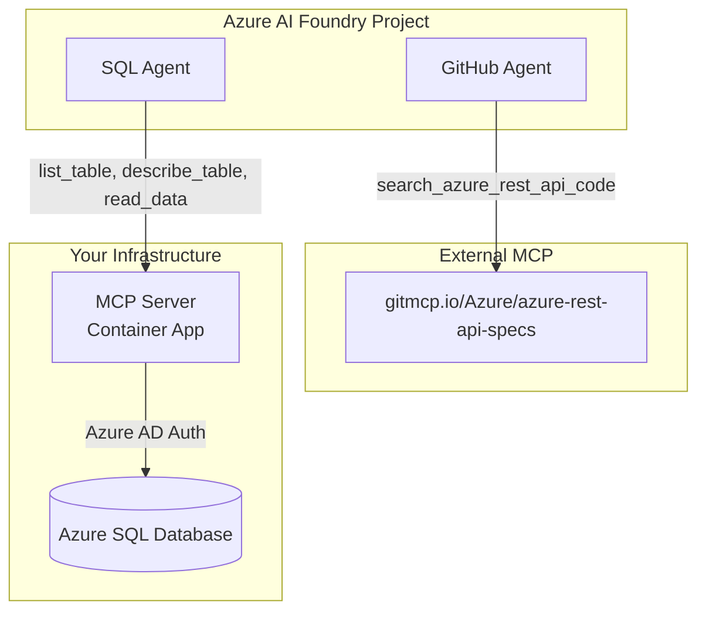

# Multi-Agent MCP Architecture with Azure AI Foundry

This repository showcases how **Azure AI Foundry Agent Service** can leverage both **internal (self-hosted)** and **external** Model Context Protocol (MCP) servers to create powerful, specialized AI agents.

## 🎯 What This Demonstrates

### **Two MCP Integration Patterns**

1. **🐙 External MCP** - Connect to third-party MCP services (GitHub, APIs, etc.)
2. **🗄️ Internal MCP** - Deploy your own MCP server with custom tools

### **Real-World Example: Multi-Agent SQL + GitHub Assistant**

- **GitHub Agent** → External MCP → Azure REST API specs repository
- **SQL Agent** → Internal MCP → Your Azure SQL Database

Both agents coexist in the same Azure AI Foundry project, giving users access to both code search and database query capabilities.

## 🚀 Architecture Overview



## 🚀 Getting Started

Choose your implementation path based on your needs:

### **🟢 External MCP** - Quick & Easy (< 15 minutes)
Perfect for getting started or integrating with existing services.
- **Guide:** [External MCP Setup](docs/EXTERNAL_MCP.md)
- **Infrastructure:** Azure AI Foundry + Model deployment only
- **Benefits:** Connect to GitHub APIs, web services, no server deployment
- **Limitation:** Restricted to available external services

### **🔵 Self-Hosted MCP** - Full Control (15-30 minutes)  
Build custom tools with complete control over functionality and data.
- **Guide:** [Self-Hosted MCP Setup](docs/SELF_HOSTED_MCP.md)
- **Infrastructure:** Azure AI Foundry + Model + SQL Server + Container Apps + Key Vault
- **Benefits:** Custom business logic, enterprise security, unlimited capabilities
- **Trade-off:** Requires infrastructure deployment and maintenance


## 📊 Comparison

| Aspect | External MCP | Self-Hosted MCP |
|--------|-------------|-----------------|
| **Setup Time** | < 15 minutes | 15-30 minutes |
| **Azure Infrastructure** | Azure AI Foundry + Model | Azure AI Foundry + Model + SQL Server + Container Apps + Key Vault |
| **Security** | No authentication required | API Key authentication |
| **Playground Testing** | ✅ Inside Azure AI Foundry Agent Service UI | ❌ SDK only (API auth limitation) |

## 🎬 Testing Your Agents

Once you've deployed your agents, test them to ensure they're working correctly:

```bash
# Test GitHub Agent (External MCP)
cd test
python test-github-agent.py
# ✅ Searches Azure REST API specifications
# ✅ No MCP server infrastructure required

# Test SQL Agent (Self-Hosted MCP)  
python test-sql-agent.py
# ✅ Queries your Azure SQL Database
# ✅ Full control over tools and security
```

## 🔗 Additional Resources

- **[Configuration Guide](docs/CONFIGURATION.md)** - Environment variables and config files
- **[Local Development](local/README.md)** - Docker-based local testing  
- **[Node.js Version](../Node/README.md)** - VS Code MCP integration (stdio)

---


*Built with ❤️ for the Azure AI Community*
