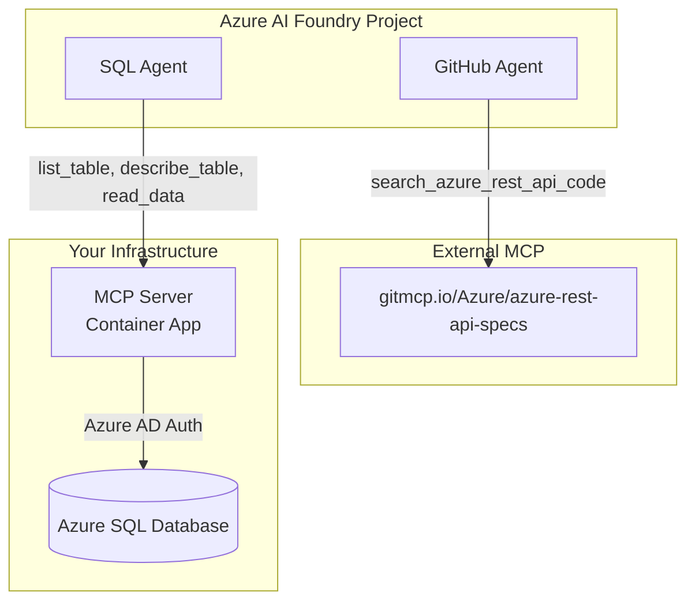

# Multi-Agent MCP Architecture with Azure AI Foundry

This repository showcases how **Azure AI Foundry Agent Service** can leverage both **internal (self-hosted)** and **external** Model Context Protocol (MCP) servers to create powerful, specialized AI agents.

## 🎯 What This Demonstrates

### **Two MCP Integration Patterns**

1. **🐙 External MCP** - Connect to third-party MCP services (GitHub, APIs, etc.)
2. **🗄️ Internal MCP** - Deploy your own MCP server with custom tools

### **Real-World Example: Multi-Agent SQL + GitHub Assistant**

- **GitHub Agent** → External MCP → Azure REST API specs repository
- **SQL Agent** → Internal MCP → Your Azure SQL Database

Both agents coexist in the same Azure AI Foundry project, giving users access to both code search and database query capabilities.

## 🚀 Architecture Overview



## 🚀 Getting Started

### **Step 1: Choose Your Path**

**🟢 New to MCP? Start Here:**
- **[External MCP Guide](docs/EXTERNAL_MCP.md)** - Connect to GitHub APIs (15 minutes)
- No infrastructure to deploy, just configure Azure AI Foundry

**🔵 Need Custom Tools? Go Here:**
- **[Self-Hosted MCP Guide](docs/SELF_HOSTED_MCP.md)** - Deploy your own SQL MCP server (30 minutes)
- Full control over tools, data, and security

### **Step 2: Set Up Your Environment**
- **[Configuration Guide](docs/CONFIGURATION.md)** - Environment variables and config files
- **[Local Development](local/README.md)** - Docker-based testing (optional)

### **Step 3: Deploy and Test**
Follow the guide for your chosen approach, then test your agents!

## 🎯 Implementation Options

### **🟢 Option 1: External MCP (Easier)**
Perfect for getting started or integrating with existing services.

**Features:**
- ✅ No MCP server infrastructure to deploy
- ✅ Requires Azure AI Foundry + model deployment
- ✅ Quick setup (< 15 minutes)
- ✅ Connect to GitHub, APIs, web services
- ⚠️ Limited to available external services

### **🔵 Option 2: Self-Hosted MCP (Most Powerful)**  
Build custom tools with full control over functionality and data.

**Features:**
- ✅ Custom business logic and data access
- ✅ Enterprise security and compliance
- ✅ Unlimited tool capabilities
- ⚠️ Requires infrastructure deployment


## 📊 Comparison

| Aspect | External MCP | Self-Hosted MCP |
|--------|-------------|-----------------|
| **Setup Time** | < 15 minutes | 15-30 minutes |
| **Azure Infrastructure** | Azure AI Foundry + Model | Azure AI Foundry + Model + SQL Server + Container Apps + Key Vault |
| **Security** | No authentication required | API Key authentication |
| **Playground Testing** | ✅ Inside Azure AI Foundry Agent Service UI | ❌ SDK only (API auth limitation) |

## 🎬 Testing Your Agents

Once you've deployed your agents, test them to ensure they're working correctly:

```bash
# Test GitHub Agent (External MCP)
cd test
python test-github-agent.py
# ✅ Searches Azure REST API specifications
# ✅ No MCP server infrastructure required

# Test SQL Agent (Self-Hosted MCP)  
python test-sql-agent.py
# ✅ Queries your Azure SQL Database
# ✅ Full control over tools and security
```

## 🔗 Related Resources

### **Documentation**
- **[External MCP Guide](docs/EXTERNAL_MCP.md)** - Third-party MCP integration (start here!)
- **[Self-Hosted Guide](docs/SELF_HOSTED_MCP.md)** - Custom MCP server deployment

### **Implementation Details**
- **[Configuration Guide](docs/CONFIGURATION.md)** - Environment setup and files
- **[Local Development](local/README.md)** - Docker-based local testing  
- **[Node.js Version](../Node/README.md)** - VS Code MCP integration (stdio)

---


*Built with ❤️ for the Azure AI Community*
