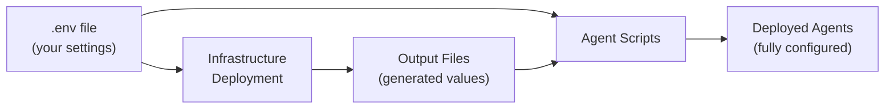

# Configuration Guide

## How Configuration Works

The project uses a **two-phase configuration model**:

1. **Input Phase**: You provide settings via `.env` file (servers, regions, etc.)
2. **Output Phase**: Deployment scripts create output files with generated values (URLs, keys, etc.)

```
Input: .env                    Deployment                Output: JSON files
├── SERVER_NAME           ──►  Scripts read .env    ──►  ├── foundry-deployment-outputs.json
├── DATABASE_NAME              and deploy                ├── mcp-sql-server-deployment-outputs.json  
├── RESOURCE_GROUP             infrastructure            └── deployment-info.json
└── AZURE_LOCATION                                            (URLs, endpoints, identity names)
```

**Why this approach?**
- `.env` = what you control (your database, preferences)
- Output files = what Azure generates (random URLs, managed identity names)
- Agent deployment scripts read both to connect everything

## Setup Steps

1. **Copy environment file:**
   ```bash
   cp .env.example .env
   ```

2. **Edit `.env` with your values:**
   ```bash
   SERVER_NAME=your-server.database.windows.net
   DATABASE_NAME=your-database
   RESOURCE_GROUP=mcp
   AZURE_LOCATION=swedencentral
   ```

3. **Deploy** - scripts automatically read `.env` and create outputs in `config/`

## Files

| File | Purpose | Location |
|------|---------|----------|
| `.env` | Your configuration | Foundry root (gitignored) |
| `.env.example` | Template | Foundry root |
| `config/deployment-info.json` | Infrastructure outputs | Auto-generated |
| `config/foundry-deployment-outputs.json` | AI Foundry outputs | Auto-generated |
| `config/mcp-sql-server-deployment-outputs.json` | MCP server outputs | Auto-generated |

All deployment outputs are gitignored to avoid committing secrets.

## Configuration Flow



**Example Flow:**
1. You set `SERVER_NAME=myserver` in `.env`
2. Infrastructure deployment reads `.env` and creates MCP server 
3. Deployment outputs `containerAppUrl=https://myapp-abc123.azurecontainer.io`
4. Agent script reads both `.env` (for database) and outputs (for MCP URL)
5. Agent connects database to MCP server automatically