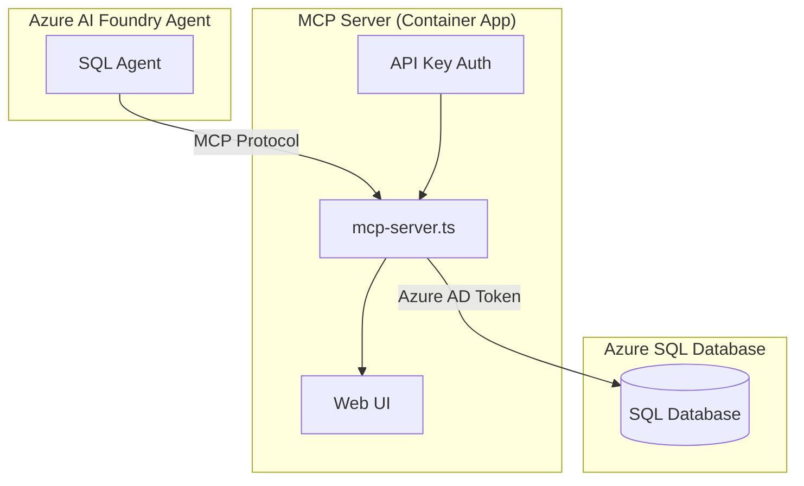

# MCP Server TypeScript Implementation

This document explains the **self-hosted MCP server** (`mcp-server.ts`) that provides SQL database access through the Model Context Protocol (MCP) for Azure AI Foundry agents.

## 🏗️ Architecture Overview

The MCP server is a **TypeScript/Node.js HTTP server** that:
- **Exposes SQL database operations** as MCP tools
- **Authenticates with Azure SQL Database** using Azure Entra ID
- **Provides secure API access** with API key authentication
- **Includes a built-in web UI** for status and documentation
- **Deploys to Azure Container Apps** for scalability



## 🔧 Configuration

### **Environment Variables**

The server can be configured through environment variables:

#### **Required Variables**
```bash
# Database Connection
SERVER_NAME=your-sql-server.database.windows.net
DATABASE_NAME=your-database-name

# Authentication
API_KEY=your-secure-api-key-here
```

#### **Optional Variables**
```bash
# Server Configuration  
PORT=3000                                    # Server port (default: 3000)
AUTH_MODE=apikey                            # Authentication mode (apikey only)
ALLOWED_ORIGINS=*                           # CORS origins (comma-separated)

# SQL Authentication
SQL_AUTH_MODE=auto                          # auto|managed-identity|service-principal
AZURE_CLIENT_ID_SQL=client-id-for-sql       # For user-assigned managed identity
CONNECTION_TIMEOUT=30                       # SQL connection timeout (seconds)
TRUST_SERVER_CERTIFICATE=false             # Trust self-signed certificates

# Performance & Security
ENABLE_RATE_LIMITING=true                   # Enable rate limiting (default: false)
```

### **SQL Authentication Modes**

The server supports multiple SQL authentication methods:

| Mode | Description | Use Case |
|------|-------------|----------|
| `auto` | Auto-detect (Managed Identity → Azure CLI) | **Recommended** - Works in Azure and locally |
| `managed-identity` | Use Azure Managed Identity | Azure Container Apps, AKS, VMs |
| `service-principal` | Service Principal with client secret | Development, testing |

**Environment variables for Service Principal:**
```bash
SQL_TENANT_ID=your-tenant-id
SQL_CLIENT_ID=your-client-id  
SQL_CLIENT_SECRET=your-client-secret
```

## 🛠️ Available MCP Tools

The server exposes three core SQL operations as MCP tools:

### **1. read_data**
Execute SELECT queries on the database.

```json
{
  "name": "read_data",
  "description": "Execute SELECT queries on the database",
  "inputSchema": {
    "type": "object",
    "properties": {
      "query": {
        "type": "string",
        "description": "SQL SELECT query to execute"
      }
    },
    "required": ["query"]
  }
}
```

**Security:** Only `SELECT` queries are allowed for data safety.

### **2. list_table**
List all tables in the database.

```json
{
  "name": "list_table", 
  "description": "List all tables in the database",
  "inputSchema": {
    "type": "object",
    "properties": {
      "parameters": {
        "type": "array",
        "description": "Optional schema names to filter",
        "items": { "type": "string" }
      }
    }
  }
}
```

**Example:** Filter by schema: `["SalesLT", "dbo"]`

### **3. describe_table**
Get schema information for a specific table.

```json
{
  "name": "describe_table",
  "description": "Get schema information for a specific table", 
  "inputSchema": {
    "type": "object",
    "properties": {
      "tableName": {
        "type": "string",
        "description": "Name of the table to describe"
      }
    },
    "required": ["tableName"]
  }
}
```

**Example:** `"SalesLT.Customer"` or `"Customer"`

## 🎨 Built-in Web UI

The server includes a **responsive web interface** accessible at the root URL:

### **Features:**
- 🟢 **Service Status** - Real-time health indicator
- 📡 **Endpoint Documentation** - All available endpoints with examples
- 🔐 **Authentication Info** - Current auth mode and requirements
- 🛠️ **Tool Overview** - Available MCP tools and their capabilities
- 🎯 **Azure AI Foundry Integration** - Quick links and setup guidance

### **Endpoints:**
```bash
GET  /               # Web UI home page
GET  /health         # Health check (public)
GET  /sse            # MCP Server-Sent Events (authenticated)
POST /sse            # MCP SSE messages (authenticated)
ALL  /mcp            # MCP StreamableHTTP for Azure AI Foundry (authenticated)
```

### **UI Screenshots:**
The web UI displays:
- Service status badges (🟢 Running, 🔐 Auth Mode, ⚠️ Azure Ready)
- Interactive endpoint documentation
- Tool capability cards
- Authentication requirements
- Direct link to Azure AI Foundry

## ➕ Adding New MCP Tools

To extend the server with additional SQL operations:

### **Step 1: Define the Tool**
Add to the `tools` array in `mcp-server.ts`:

```typescript
const tools = [
  // ... existing tools
  {
    name: 'create_table',
    description: 'Create a new table in the database',
    inputSchema: {
      type: 'object',
      properties: {
        tableName: {
          type: 'string',
          description: 'Name of the table to create'
        },
        columns: {
          type: 'array',
          description: 'Column definitions',
          items: {
            type: 'object',
            properties: {
              name: { type: 'string' },
              type: { type: 'string' },
              nullable: { type: 'boolean' }
            }
          }
        }
      },
      required: ['tableName', 'columns']
    }
  }
];
```

### **Step 2: Add Request Handler**
Update the `CallToolRequestSchema` handler:

```typescript
mcpServer.setRequestHandler(CallToolRequestSchema, async (request) => {
  const { name, arguments: args } = request.params;
  
  try {
    await ensureSqlConnection();
    let result;

    switch (name) {
      // ... existing cases
      case 'create_table':
        result = await executeCreateTable(args, user);
        break;
      default:
        return {
          content: [{ type: 'text', text: `Unknown tool: ${name}` }],
          isError: true,
        };
    }

    return {
      content: [{ type: 'text', text: JSON.stringify(result, null, 2) }],
    };
  } catch (error) {
    return {
      content: [{ type: 'text', text: `Error: ${error instanceof Error ? error.message : 'Unknown error'}` }],
      isError: true,
    };
  }
});
```

### **Step 3: Implement the Function**
Add the implementation function:

```typescript
async function executeCreateTable(args: any, user?: UserInfo) {
  const { tableName, columns } = args;
  
  if (!tableName || !columns || !Array.isArray(columns)) {
    throw new Error('tableName and columns array are required');
  }

  // Validate table name for security
  if (!/^[a-zA-Z_][a-zA-Z0-9_]*(\.[a-zA-Z_][a-zA-Z0-9_]*)?$/.test(tableName)) {
    throw new Error('Invalid table name format');
  }

  const columnDefs = columns.map(col => 
    `${col.name} ${col.type} ${col.nullable ? 'NULL' : 'NOT NULL'}`
  ).join(', ');

  const query = `CREATE TABLE ${tableName} (${columnDefs})`;
  
  const request = new sql.Request();
  await request.query(query);
  
  return {
    success: true,
    message: `Table ${tableName} created successfully`,
    tableName,
    columnCount: columns.length,
    executedAt: new Date().toISOString(),
    executedBy: user?.displayName || user?.userId || 'unknown'
  };
}
```

## 🔒 Security Considerations

### **API Key Authentication**
- **Required**: All MCP endpoints require valid API key
- **Headers**: `X-API-Key: your-key` or `Authorization: Bearer your-key`
- **Storage**: Store API key in Azure Key Vault
- **Rotation**: Regularly rotate API keys for security

### **SQL Injection Protection**
- **Parameterized Queries**: Use `sql.Request().input()` for user data
- **Query Restrictions**: Only SELECT queries allowed in `read_data`
- **Input Validation**: Validate table names and schema names
- **Escape Sequences**: Avoid string concatenation in SQL

### **Network Security**
- **CORS Configuration**: Restrict `ALLOWED_ORIGINS` to trusted domains
- **Rate Limiting**: Enable `ENABLE_RATE_LIMITING=true` for production
- **Container Apps**: Use built-in ingress restrictions
- **Private Endpoints**: Consider Azure Private Link for SQL connections

### **Azure Entra ID Integration**
- **Managed Identity**: Preferred authentication method
- **Token Refresh**: Automatic token renewal before expiration
- **Least Privilege**: Grant only necessary SQL permissions
- **Audit Logging**: Enable SQL audit logs for compliance

## 🚀 Deployment

### **Azure Container Apps**
The server is designed for Azure Container Apps deployment:

```bash
# Build and deploy
cd infrastructure/mcp-sql-server
./deploy.ps1
```

**Key benefits:**
- ✅ **Auto-scaling** based on HTTP traffic
- ✅ **Managed Identity** for secure SQL access
- ✅ **Health checks** with built-in monitoring
- ✅ **Environment variables** for configuration
- ✅ **Container registry** integration

### **Local Development**
For local development and testing:

```bash
# Install dependencies
cd app
npm install

# Set environment variables
cp .env.example .env
# Edit .env with your configuration

# Run in development mode
npm run dev

# Build for production
npm run build
npm start
```

**Requirements:**
- Node.js 22+ (Alpine Linux in container)
- TypeScript compiler
- Azure CLI (for local SQL authentication)

## 🔧 Troubleshooting

### **Common Issues**

**Connection Timeouts:**
```bash
# Increase timeout
CONNECTION_TIMEOUT=60
```

**Authentication Failures:**
```bash
# Check managed identity
az account get-access-token --resource https://database.windows.net/

# Verify API key
curl -H "X-API-Key: your-key" http://localhost:3000/health
```

**CORS Errors:**
```bash
# Allow specific origins
ALLOWED_ORIGINS=https://ai.azure.com,https://your-domain.com
```

### **Health Check Endpoint**
Monitor server health:
```bash
curl http://your-server/health
```

Response:
```json
{
  "status": "healthy",
  "timestamp": "2025-11-10T10:00:00.000Z", 
  "service": "mssql-mcp-server-foundry",
  "version": "1.0.0",
  "protocol": "MCP over SSE"
}
```

### **Logging and Monitoring**
- **Console Logs**: Structured logging with timestamps
- **Container Logs**: Available in Azure Container Apps logs
- **Health Checks**: Built-in Docker health check
- **Application Insights**: Add for advanced monitoring

## 📚 Additional Resources

- **[Model Context Protocol Specification](https://spec.modelcontextprotocol.io/)** - Official MCP documentation
- **[Azure AI Foundry MCP Guide](https://learn.microsoft.com/azure/ai-foundry/how-to/agents/mcp)** - Microsoft's MCP integration guide  
- **[Azure Container Apps Documentation](https://learn.microsoft.com/azure/container-apps/)** - Deployment platform docs
- **[Azure SQL Database Security](https://learn.microsoft.com/azure/azure-sql/database/security-overview)** - SQL security best practices

---

*This MCP server provides a secure, scalable foundation for adding SQL database capabilities to your Azure AI Foundry agents.* 🚀